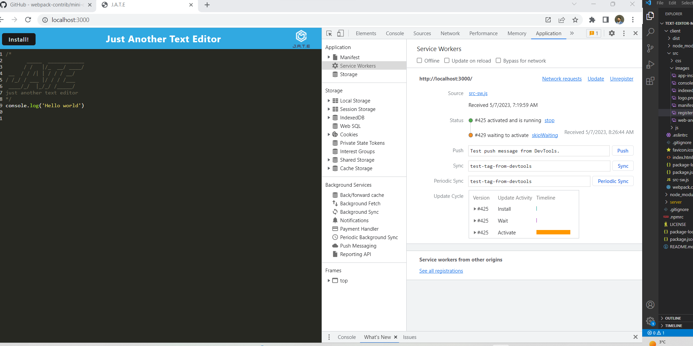

# Text_Editor


## Description:
```
As you have progressed through this course, you have put together a number of impressive projects that you can show off to potential employers. This project is no exception; in fact, it features some of the most impressive expressions of the concepts you have learned so far.
Your task is to build a text editor that runs in the browser. The app will be a single-page application that meets the PWA criteria. Additionally, it will feature a number of data persistence techniques that serve as redundancy in case one of the options is not supported by the browser. The application will also function offline.
To build this text editor, you will start with an existing application and implement methods for getting and storing data to an IndexedDB database. You will use a package called idb, which is a lightweight wrapper around the IndexedDB API. It features a number of methods that are useful for storing and retrieving data, and is used by companies like Google and Mozilla.
```

## Table of Contents:<br />

- [Installation](#installation)<br />

- [Usage](#usage)<br />

- [Contributing](#contributing)<br />

- [Testing](#testing)<br />

- [Github](#my_github_profile)<br />

- [Licence](#license)<br />

- [Questions](#questions)<br />

## Installation:
To install the necessary dependancies please run the following command:
```
To install the necessary dependancies please run the following command: npm run start
```

## Usage:

To view this application,the following image shows the landing page of the application, or click on the page link that demonstrates the functionality of this project:\


APP installation:


Web APP interface:


Manifest.json:



IndexedDB:


## Contributing:

Clone the project to your own machine useing $ git clone.Pull requests are welcome. For major changes, please open an issue first to discuss what you would like to change.

## Testing:

```
open server.js on integrated terminal and use command 'npm run  start'  to run the program
```


## My GitHub profile:

This is My GitHub profile; ManojAdikari
[see my GitHub profile ](https://github.com/ManojAdikari)


## License:
```
This project is licensed under; MIT_License
```

## Questions:
[Please use this this video url for more information about this application ](https://drive.google.com/file/d/1cGsK8qqH_QS9pGQq-YaeEUWvYqkNKx3h/view?usp=sharing)<br />
[see this project Repositorie ](https://github.com/ManojAdikari/Social_Network_API.git)<br />
[Clone this project](https://github.com/ManojAdikari/Social_Network_API.git) <br />
[Clone this project](git@github.com:ManojAdikari/Social_Network_API.git)<br />
If you have any questions about this project please feel free to reach  via email at [manojpadikari@gmail.com](mailto:manojpadikari@gmail.com).